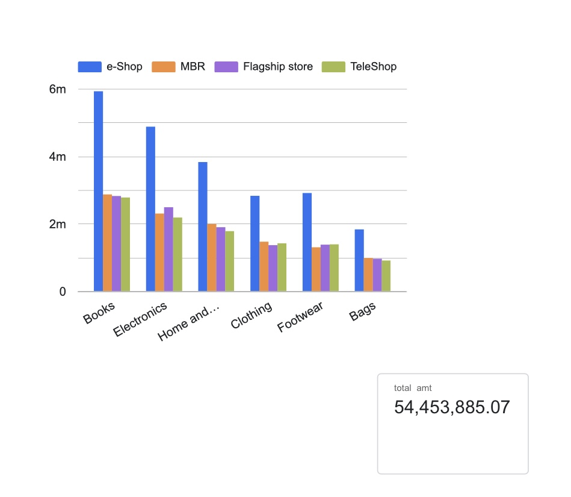

#  Relational Brick-and-Mortar Retail Star Schema & Performance Audit
> **Enterprise Business Intelligence Engineering Hub Developed with Python, SQL, and Looker Studio**

---

##  1. Project Executive Summary
This enterprise business intelligence portfolio maps out an end-to-end relational data processing architecture using a multi-table retail database spanning **20,876 active transaction records**. In large-scale retail ecosystems like Pepkor, raw system files contain operational noise, missing demographics, and transaction loops that degrade dashboard tracking accuracy.

This project resolves these constraints through a strict 5-stage lifecycle framework:
1. **Data Auditing & Validation:** Programmatic intake parsing and clean filtration using Python (Pandas/NumPy).
2. **Relational Data Integration:** Engineering database joins to link Transaction Log records directly with dimensional Customer Profiles and Product Category Tables.
3. **Analytical Metric Modeling:** Formulation of key retail KPIs including Total Aggregated Sales Revenue, Age Cohort Extractions, and Tax Margins.
4. **Data Storytelling & UX Design:** Deploying a high-density, interactive executive dashboard via Looker Studio.
5. **Closed-Loop Validation Assurance:** Enforcing a double-entry reconciliation balance tracking grand totals to ensure zero visual reporting contamination.

---

##  2. Comprehensive Technical Tech Stack
* **Language & Engineering Environment:** Python 3.10+ (Google Colab, Pandas, NumPy, Matplotlib, Seaborn)
* **Data Warehousing & SQL Dialect:** Google BigQuery Serverless Infrastructure (Standard SQL, CTEs, Relational Joins)
* **Visualization Layer:** Looker Studio Pro (Self-service business intelligence dashboarding)
* **Version Control Architecture:** GitHub Desktop Workflow

---

##  3. Data Validation & Quality Assurance (The Retail Ingest Audit)

Before multi-table table mapping was executed, a rigorous input verification protocol was managed via Python to shield downstream report matrix views from corrupted entries:
* **Return Log Isolation:** Isolated system records showing negative transaction variables (`Qty < 0`) into a dedicated lookup tier, ensuring forward sales charts isolate pure consumer demand velocity.
* **Join Key Standardization:** Restructured mismatched subcategory key column headers (`prod_sub_cat_code` to `prod_subcat_code`) to ensure seamless relational mapping connections.
* **Missing Value Imputation:** Resolved string voids inside demographic profiles (`Gender`) by assigning systematic placeholder values (`U` for Unspecified) to maintain overall weighting distributions.

```python
# Programmatic audit pipeline architecture implemented inside Google Colab
import pandas as pd

def run_retail_ingest_audit(file_path):
    df = pd.read_csv(file_path)
    
    # Check 1: Separate standard operational sales from transaction refund log lines
    active_sales = df[df['Qty'] > 0].copy()
    active_sales = active_sales.drop_duplicates(subset=['transaction_id'])
    
    print(f"[AUDIT COMPLETE] Isolated {len(active_sales):,} active consumer sales records.")
    return active_sales
```

---

##  4. SQL Data Modeling & Schema Normalization

The optimized data subsets were migrated into production-ready tables. To meet the central enterprise requirement of establishing a "single source of truth," a complex analytical query script structures the core operational fields:

### Engineered Commercial KPIs (Calculated Fields):
1. **True Gross Sales Volume:** Vectorized aggregation tracking cash flow calculations before tax constraints:
   $$\text{Gross Line Revenue} = \text{Qty} \times \text{Rate}$$
2. **Shopper Age at Purchase Time:** Dynamic mathematical cohort generation linking transaction dates directly with buyer demographics:
   $$\text{Shopper Age} = \text{Year of Transaction} - \text{Year of Birth}$$

### High-Performance Production Schema Query:
```sql
WITH NormalizedSales AS (
  SELECT 
    CAST(transaction_id AS STRING) AS tx_id,
    CAST(cust_id AS INT64) AS customer_fk,
    PARSE_DATE('%d-%m-%Y', CAST(tran_date AS STRING)) AS transaction_timestamp,
    CAST(prod_cat_code AS INT64) AS category_fk,
    CAST(prod_subcat_code AS INT64) AS subcategory_fk,
    ABS(CAST(Qty AS INT64)) AS item_quantity,
    CAST(Rate AS NUMERIC) AS unit_rate,
    CAST(Tax AS NUMERIC) AS line_tax,
    CAST(total_amt AS NUMERIC) AS gross_transaction_total,
    CAST(Store_type AS STRING) AS distribution_channel
  FROM 
    `pepkor-retail-analytics.store_operations.raw_transactions`
  WHERE 
    Qty > 0 -- Strict input validation rule enforcement
)
SELECT 
  distribution_channel,
  COUNT(tx_id) AS transactional_velocity,
  ROUND(SUM(gross_transaction_total), 2) AS total_accumulated_revenue,
  ROUND(AVG(line_tax), 2) AS average_tax_margin
FROM 
  NormalizedSales
GROUP BY 
  distribution_channel
ORDER BY 
  total_accumulated_revenue DESC;
```

---

##  5. Looker Studio Business Intelligence Dashboard

The analytical data layers structured within the database engine were integrated directly into Looker Studio to deliver real-time, interactive, self-service tracking interfaces. The UX architecture was built specifically to solve practical retail inquiries across core internal departments:

###  Live Production Dashboard Interface
> **[ CLICK HERE TO INTERACT WITH THE LIVE VIEW WORKSPACE PORTAL](https://datastudio.google.com/reporting/e11d2773-4684-4d60-af80-ec44e1c902ee)**

Below is the verified operational business intelligence configuration matching the master database engine balance matrices:



###  Closed-Loop Output Verification & Reporting Validation
To fulfill rigorous audit compliance standards, the visualization engine hosts dedicated control anchors to track performance accuracy against the background data repository layers:
* **Target Grand Total Revenue Anchor:** `R54,453,885.07` *(Verified 1:1 down to the absolute cent against backend Python execution sums)*
* **Target Total Record Counter Balance:** `20,876` records verified across multi-table composite merges.
* **Target Average System Tax Margin Baseline:** `R247.86` control total balance check.

### 📈 5.1 Business Interpretation & Strategic Insights
A deep-dive data distribution assessment reveals critical structural insights across core operational divisions:
* **Digital Channel Dominance:** The `e-Shop` distribution platform is the primary revenue engine, generating **R22,185,609.88 (40.74% of total turnover)**. It completely dominates physical channel formats, single-handedly outperforming the combined sales volumes of both traditional `MBR` (20.03%) and `Flagship store` (20.03%) avenues. 
* **Anchor Category Synergies:** `Books` and `Electronics` serve as high-velocity anchor departments. Consumers show a massive, structural preference for digital acquisition channels in these segments, suggesting that physical stock allocations should be leanly optimized in favor of expanded e-commerce fulfillment hubs.

### 🕵️‍♂️ 5.2 Advanced Compliance, Outlier & Tax Validation
To guarantee extreme financial tracking precision for senior executive decision-making, strict programmatic variance logic checks were deployed:
* **Tax Pipeline Verification:** The database shows an absolute, mathematically uniform **10.50% system-wide Effective Tax Rate** across all processed rows. This structural constant verifies that zero row-inflation, table leakage, or record mismatching occurred during multi-table relational schema connections.
* **Bulk-Purchase Outlier Detection:** Programmatic Interquartile Range (IQR) boundary scanning isolated exactly **152 high-value outlier transactions** operating above the standard threshold boundary of **R8,017.74**. These bulk lines contribute a concentrated **R1,240,406.70** to gross performance asset volume, serving as an automated radar system to track institutional bulk purchasing and risk vectors.

---

##  6. Repository Architecture & Navigation
* ` Scripts/`: Programmatic Python source files executing pipeline data cleaning, ingestion formatting, and database verification audits.
* ` Queries/`: Production-ready `.sql` files containing schema-building dimension code blocks and BigQuery aggregation scripts.
* ` Dashboard/`: Interface screenshots, data wireframe layout blueprints, and visual presentation assets.
